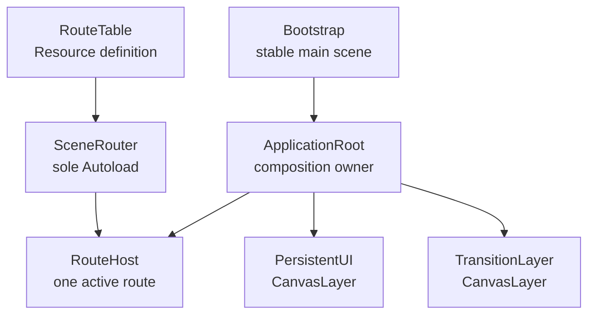
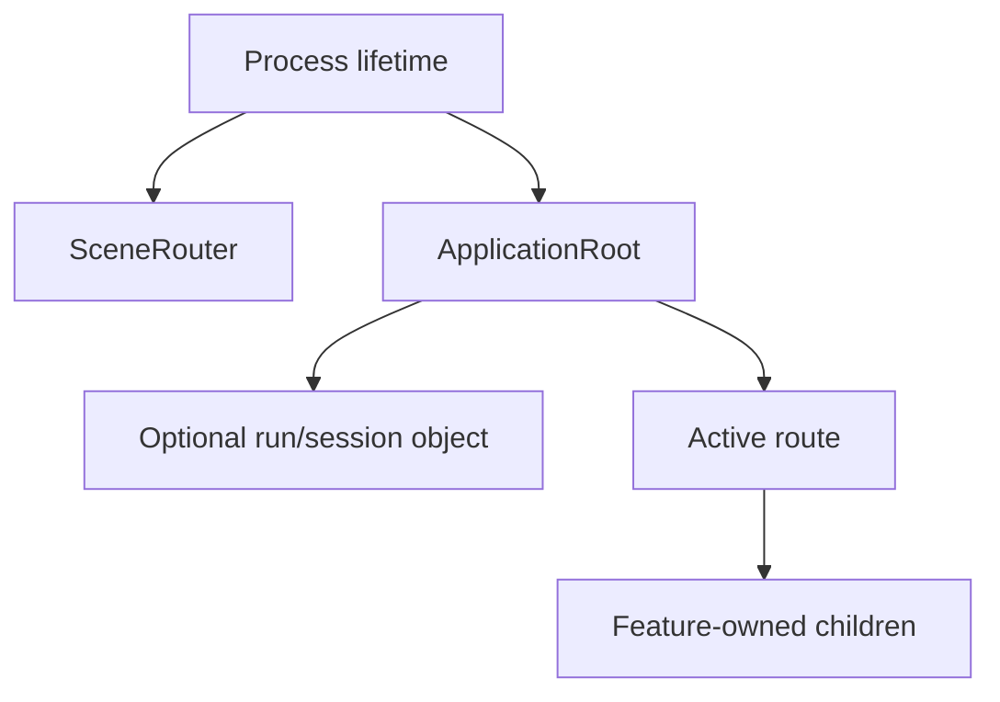
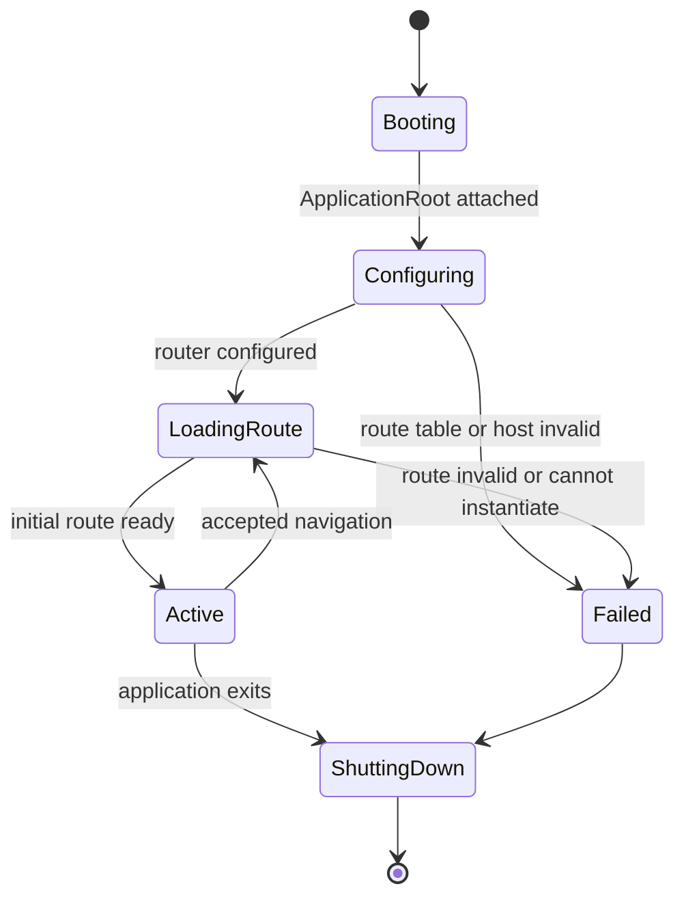
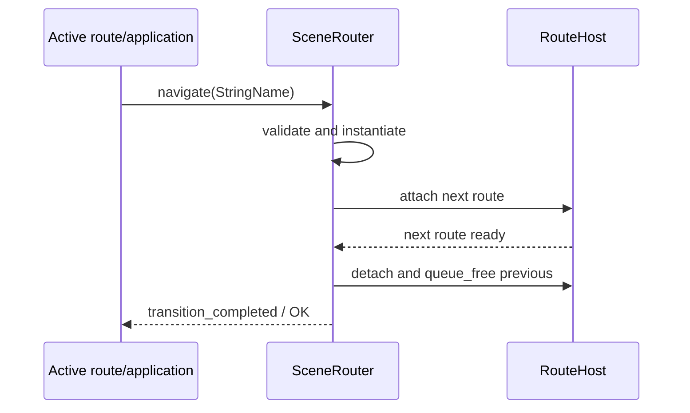
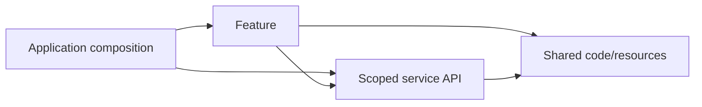

# Runtime Architecture Overview

Forge2D Template boots through a small application shell that owns full-screen
navigation without assuming a game genre. This document is the durable runtime
reference. ADR-0002 through ADR-0005 explain why the folder, composition,
Autoload, and dependency boundaries exist; the
[M05 ExecPlan](../plans/M05_game_architecture_baseline.md) records their first
implementation.

## System topology

`Bootstrap` remains the stable `project.godot` main scene. It creates one
`ApplicationRoot`, which configures the process-wide `SceneRouter` and requests
the neutral `template_home` route. The router attaches full-screen routes below
the application's `RouteHost`; it never changes the global `SceneTree` scene.

The active route root may be a `Node`, `Node2D`, `Control`, or mixed scene. A
world-based project can therefore own a Camera2D and HUD inside a route, while a
menu-heavy, card, puzzle, narrative, or tool-like project can use a Control-first
route without adapting the core.

## Ownership and lifetimes

| Lifetime | Owner | Baseline responsibility |
| --- | --- | --- |
| Process | Godot root / Autoload | `SceneRouter` keeps only the active application host, route definition, and current-route references. |
| Application | `ApplicationRoot` | Owns `RouteHost`, persistent UI, transition presentation, and future run/session objects. |
| Run/session | `ApplicationRoot` or owning feature | Holds explicitly created runtime state; it is never an Autoload. |
| Route | `RouteHost` through `SceneRouter` | Owns one full-screen screen, mode, world, or tool view at a time. |
| Feature/component | Parent scene | Creates and frees local scenes, resources, cameras, and presentation. |

Godot frees application children with their parent. `ApplicationRoot` also calls
`SceneRouter.unconfigure(RouteHost)` during exit, and the router listens for the
host's `tree_exiting` signal as a defensive cleanup path. Process-wide code does
not retain an application node after shutdown.

## Startup lifecycle

Bootstrap emits `composition_failed(error, message)` and writes an engine error
when application startup reports a failure. `ApplicationRoot` emits
`startup_failed(error, message)` and remains inactive if router configuration or
initial navigation fails. A failed request never removes the existing route.

## Route definitions

`RouteTable` is a custom Resource with an exported ordered list of typed
`RouteEntry` Resources. Each entry contains:

- `route_id: StringName`
- `scene: PackedScene`

An entry list was selected instead of a Dictionary because it can report a
duplicate ID before lookup and gives each editor-authored route an explicit
typed unit. `validation_errors()` reports null entries, empty IDs, duplicates,
and missing scenes. `scene_for(id)` performs read-only lookup, and `route_ids()`
returns a new array so callers cannot mutate lookup state through it. Exported
Resources are definitions; a feature must duplicate one before instance-specific
mutation could leak between scene instances.

Route IDs belong to application composition. The baseline defines only
`template_home`; test IDs live only in test fixtures.

## SceneRouter contract

`SceneRouter` is the only Autoload registered by the baseline. Its public API is:

| API | Result |
| --- | --- |
| `configure(route_host, route_table) -> Error` | Validates an in-tree host and the complete table. Repeating the same valid configuration is idempotent; an active configuration cannot be silently replaced. |
| `navigate(route_id) -> Error` | Validates, instantiates, attaches, and activates one route synchronously. |
| `unconfigure(route_host) -> Error` | Clears references only when the caller owns the configured host and no transition is active. |
| `is_configured()` | Reports whether a live in-tree host and table are available. |
| `get_route_host()` | Returns the current host or `null`. |
| `get_current_route()` | Returns the active route or `null`. |
| `get_current_route_id()` | Returns the active ID or an empty `StringName`. |

Typed lifecycle signals are:

- `transition_started(route_id)`
- `transition_completed(route_id, route)`
- `transition_failed(route_id, error, message)`

Expected failure codes include `ERR_UNCONFIGURED` before setup,
`ERR_INVALID_PARAMETER` for an empty ID or invalid host/table,
`ERR_INVALID_DATA` for invalid table entries, `ERR_DOES_NOT_EXIST` for an unknown
ID, `ERR_CANT_CREATE` for an uninstantiable route, `ERR_ALREADY_IN_USE` when an
active configuration would be replaced, and `ERR_BUSY` for re-entrant
navigation or teardown.

The router marks a transition busy before `transition_started`. A navigation
request made re-entrantly from that signal receives `ERR_BUSY` and cannot
overtake the active replacement. The next route completes `_ready` when attached
before the previous route is detached and queued for deletion. If validation,
instantiation, attachment, or readiness fails, the previous route remains the
current child.

The API deliberately has no arbitrary payload, history stack, feature-node
registry, pause side effect, or gameplay data.

## Dependency direction

Arrows point from consumer to dependency:

- Application composition may assemble a feature but implements no gameplay.
- A feature may depend on its own files, shared definitions, and narrow service
  APIs; it may not import another feature or application internals.
- Shared code depends only on shared code and engine APIs.
- A service depends only on shared definitions and Godot/platform APIs.
- Parents pass collaborators and data downward. Children emit typed signals
  upward. Absolute cross-tree searches, node-group command buses, and catch-all
  global events are forbidden.
- A shared abstraction needs a second real consumer. A new Autoload additionally
  needs process lifetime, a narrow contract, and dedicated tests.

Full-screen navigation uses `SceneRouter.navigate`; feature-owned local scene
composition uses normal parent/child ownership. Runtime code must not call
`SceneTree.change_scene_*`.

## 2D rendering, UI, and camera ownership

| Concern | Owner | Rule |
| --- | --- | --- |
| World content | Active route/feature | Use `Node2D` where transforms are required. |
| Full-screen route UI | Active route | Use `Control` anchors and containers rather than fixed screen coordinates. |
| Persistent application UI | `ApplicationRoot/PersistentUI` | Independent of route transforms and Camera2D. Empty until a real capability needs it. |
| Route transitions | `ApplicationRoot/TransitionLayer` | One application-owned layer; no visual policy is imposed in M05. |
| Camera2D | Owning feature | The shell neither creates nor globally controls a camera. |
| Lighting/post-processing | Owning feature or proven shared scene | No mandatory look or rendering effect. |
| Physics/collision | Owning project capability | Add layers and bodies only with a real feature. |

The starter project keeps a `960x540` logical viewport and `canvas_items`
stretch. Runtime code treats neither dimension as a constant. Integer scaling,
pixel snapping, aspect policy, and stretch behavior remain project-level art and
display choices.

## Input, pause, time, and data

- Runtime code reads named InputMap actions and never physical key, controller,
  mouse, or touch codes.
- `ui_*` belongs to interface navigation; `app_*` is reserved for application
  intent such as back or pause; gameplay actions receive a feature/capability
  prefix only when that feature exists.
- Application pause is an application decision, not a router behavior. Feature
  and world nodes pause with the SceneTree by default. Only resume/quit UI may
  opt into always-processing mode.
- `_physics_process` is for fixed-step motion/physics, `_process` for variable-
  step presentation. The idle baseline implements neither.
- Nodes own tree lifetime and presentation. Resources hold static definitions
  and serializable contracts. RefCounted objects hold small runtime logic with
  no tree callbacks. Autoloads hold narrow tested process infrastructure only.

Settings, save, audio, localization, input remapping, session state, and gameplay
systems remain optional capabilities for later milestones. They do not require
changing the ownership model above.
