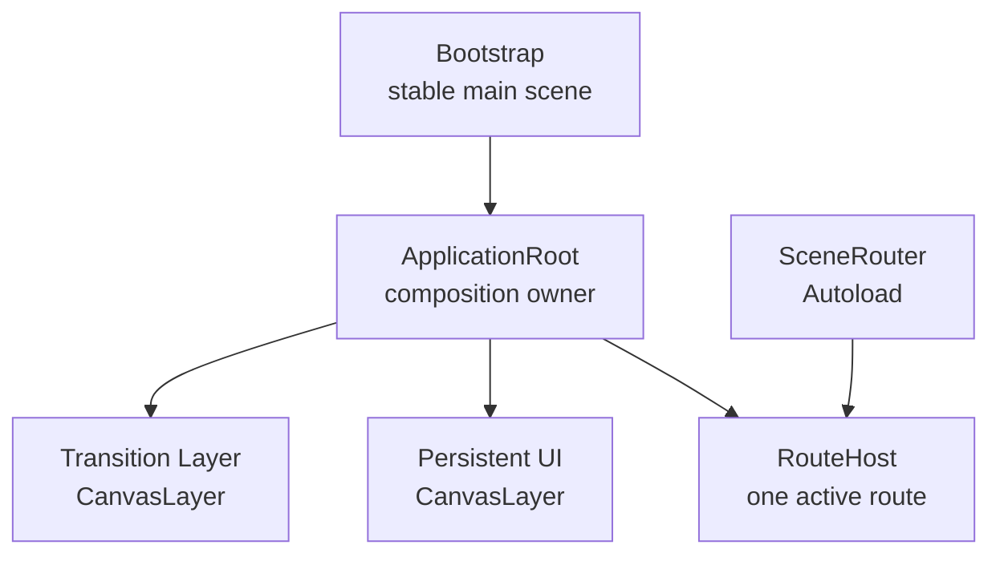
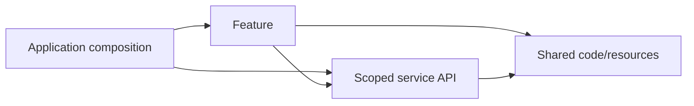
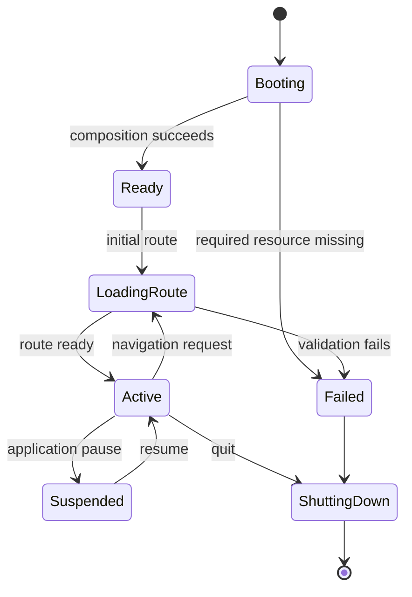
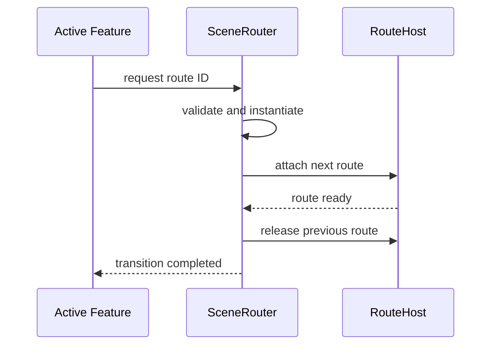

<!-- AUTO-GENERATED:backlink START -->
[← Back](plans.md)
<!-- AUTO-GENERATED:backlink END -->
# M05 Game Architecture Baseline ExecPlan

This document is a living execution plan for implementing the first usable,
genre-neutral 2D runtime architecture of Forge2D Template. It supersedes the
documentation-only closure formerly recorded in the retired
`M05_runtime_architecture.md` plan. ADR-0002 through ADR-0005 remain
accepted and are the starting constraints for this milestone.

## Purpose / Big Picture

Forge2D Template already has a tested Godot bootstrap, repository-local Python
tooling, and documented dependency rules. It does not yet have an application
composition root, a real navigation boundary, or a runtime structure in which
multiple features can be added safely.

M05 turns the documented architecture into a minimal running baseline. A fresh
project created from Forge2D Template will provide one stable boot path, one
explicit application composition root, one replaceable active route, a small
process-wide service boundary, one-way feature dependencies, separate world/UI/
transition ownership, and headless lifecycle and routing tests. No project must
first delete a genre-specific gameplay system.

The result must remain natural for world-based, UI-driven, puzzle, card, board,
strategy, arcade, narrative, simulation, and tool-like 2D projects.

## Execution Rules

- Read `AGENTS.md`, `.agent/PLANS.md`, ADR-0001 through ADR-0005, the current
  Bootstrap scene and script, and the Godot test runner before editing.
- Preserve unrelated user changes and do not rewrite Git history.
- Keep this plan's Progress, Surprises & Discoveries, Decision Log, Validation,
  and Outcomes current as implementation knowledge changes.
- Do not add a dependency, addon, test framework, asset, or generated cache.
- Do not add gameplay-specific abstractions such as combat, inventory, actors,
  levels, quests, dialogue, networking, ECS, or tile maps.
- Do not create empty directories or placeholder services.
- Do not push, tag, publish, or alter GitHub settings.
- Run the fastest relevant checks first and record only commands actually run.

## Current State

At the start of M05, `game/project.godot` starts
`res://scenes/bootstrap.tscn`. Bootstrap is a full-screen `Control` with a static
readiness label, and `game/src/bootstrap.gd` contains only the Bootstrap class.
There is no Autoload, application root, route table, runtime feature, or session
object. `game/tests/bootstrap_integration_test.gd` verifies the exact Bootstrap
contract and emits the marker required by the release gate.

ADR-0002 defines feature-owned folders, ADR-0003 defines centralized application
composition and navigation, ADR-0004 permits only narrowly scoped process-wide
services and identifies `SceneRouter` as the first justified Autoload, and
ADR-0005 requires one-way dependencies without a global event bus, service
locator, or global mutable gameplay state.

The previous M05 document accepted those ADRs while deliberately deferring
runtime implementation. This plan closes that gap.

## Architecture Goals

| Goal | Required property |
| --- | --- |
| Generality | Core code contains no genre-specific feature or terminology. |
| 2D focus | World content, full-screen UI, persistent UI, transitions, and cameras have explicit owners. |
| Small core | Only behavior needed to boot, compose, navigate, and test is implemented. |
| Explicit ownership | Every scene, node, resource, signal, and service has one lifecycle owner. |
| Replaceability | A route can be added, tested, or removed without changing unrelated features. |
| Testability | Routes can be instantiated without replacing the global `SceneTree`. |
| Data orientation | Static configuration uses Resources; Nodes own lifecycle and presentation. |
| Safe growth | Shared abstractions need two consumers; Autoloads need process lifetime and tests. |
| Portable input | Runtime code consumes named InputMap actions, never physical devices. |
| Stable bootstrap | Existing commands and the CI success marker remain valid. |

## Scope and Non-Goals

In scope are:

1. replacing the old documentation-only M05 plan with this implementation plan;
2. adding an application composition scene below Bootstrap;
3. adding and registering a tested `SceneRouter` Autoload;
4. adding a neutral initial route;
5. defining lifecycle, route ownership, pausing, input naming, rendering, and
   data-model rules;
6. adding repository-owned Godot tests and neutral fixtures;
7. adding a durable architecture overview with GitHub-native Mermaid diagrams;
8. updating the documentation index and only those ADRs contradicted by evidence;
9. adding an M05 report with exact validation evidence; and
10. keeping the standard repository gate green where locally executable.

Out of scope are gameplay rules, mandatory feature base classes, event buses,
service locators, dependency-injection containers, mutable global game state,
settings/save/audio/localization UI, networking, physics, cameras, tile maps,
navigation, animation frameworks, object pools, ECS, export packaging, physical
device bindings, remapping UI, and speculative optimization.

## Target Runtime Architecture

Bootstrap remains the stable project entry point and creates the application
composition root. The application root owns the route host, persistent UI,
transition layer, and any future run-lifetime context. `SceneRouter` is
process-wide infrastructure and owns no gameplay state.

The active route may be a `Node2D`, `Control`, plain `Node`, or mixed scene. It
owns its local world nodes, UI, Camera2D, and feature components. The application
shell assumes no player, level, map, match, or camera.

### Ownership and lifetimes

| Lifetime | Owner | Examples | Rule |
| --- | --- | --- | --- |
| Process | Godot root / Autoload | `SceneRouter` | No gameplay state or feature-node references after transitions. |
| Application | `ApplicationRoot` | route host, persistent UI, transitions | Lives from successful boot until shutdown. |
| Run/session | `ApplicationRoot` or owning feature | optional run data | Explicitly created and disposed; never an Autoload. |
| Route | `RouteHost` through `SceneRouter` | full-screen screens or modes | Exactly one active route in the baseline. |
| Component | Parent feature scene | owned child scenes | Parent creates and frees the child. |

### Dependency direction

- Application composition assembles features but does not implement their rules.
- A feature may use its own files, shared code, and narrow service APIs.
- A feature must not import another feature.
- Shared code knows no feature, application scene, or service.
- Services know no feature or application implementation.
- Parents pass data and collaborators down; children emit typed signals up.
- Cross-tree searches are not dependency injection.

### Application lifecycle

A required startup-route failure must be visible and non-silent. A navigation
failure must not destroy the currently active route.

### Route transition contract

Observable rules:

- Route IDs are composition-owned `StringName` values.
- A typed route table maps IDs to `PackedScene` resources.
- Only the router replaces the full-screen route.
- Local child scenes remain feature-owned.
- Concurrent replacement is serialized or rejected deterministically.
- Invalid IDs and failed instantiation emit a typed failure and return an error.
- The old route remains active until the replacement is ready.
- Successful replacement frees the old route exactly once.
- Navigation has no catch-all payload and retains no feature-specific state.

## Runtime Responsibilities

### Bootstrap

Bootstrap remains the configured main scene, creates exactly one
`ApplicationRoot`, reports composition failure, and contains no navigation,
gameplay, persistence, audio, input policy, or session state.

### ApplicationRoot

`ApplicationRoot` owns `RouteHost`, empty persistent and transition CanvasLayers,
configures `SceneRouter`, requests the neutral initial route after successful
configuration, owns future session objects, and clears its router registration
during shutdown. The route host accepts any valid scene-root Node type.

### SceneRouter

`SceneRouter` is the only M05 Autoload. It exposes a narrow API, rejects use
before configuration, validates route IDs and scenes, rejects re-entrant
navigation deterministically, keeps the current route until its replacement is
ready, emits typed transition signals, clears application-owned references on
exit, and contains no feature terminology or arbitrary state payload.

Settings, save, and audio remain documented extension points, not placeholders.

### RouteTable Resource

Route configuration uses custom Resources. It contains unique, non-empty
`StringName` IDs and non-null `PackedScene` values, exposes lookup without a
mutable lookup map, and supports editor assignment and direct construction in
tests. The exact serialized representation is recorded in the Decision Log.

### Features

A feature is an ownership boundary, not an inheritance hierarchy. It may have a
`Node2D`, `Control`, or `Node` root; owns local files and children; documents
public signals and collaborators; and may call the router's narrow route API.
It may not call `SceneTree.change_scene_*`, inspect unrelated routes, or import
another feature. M05 adds no speculative base feature, actor, component, or
system class.

## 2D Baseline Conventions

| Concern | Owner | Baseline rule |
| --- | --- | --- |
| World content | Active route/feature | Use `Node2D` only where spatial transforms are needed. |
| Full-screen UI | Active route | Use anchors and containers, not fixed screen coordinates. |
| Persistent UI | `ApplicationRoot` CanvasLayer | Independent of route world transforms and cameras. |
| Transitions | Dedicated application CanvasLayer | One application boundary, not per-feature duplication. |
| Camera2D | Owning feature | The core creates and controls no camera. |
| Lighting/post-processing | Owning feature or proven shared scene | No mandatory visual style. |
| Physics/collision | Owning capability | Add named layers only for a real feature. |

The `960x540` canvas and `canvas_items` stretch remain starter project settings,
not runtime constants. Pixel snapping, integer scaling, aspect-ratio policy, and
stretch behavior remain project policies.

Runtime code reads named InputMap actions. `ui_*` is reserved for interface
navigation, `app_*` for application intent, and gameplay actions use a feature
prefix when real features exist. The baseline adds no hypothetical input action
or physical key/controller/touch assumption.

Pause is an application decision, not a router effect. Feature nodes pause with
the tree by default. Only UI needed to resume or quit may process always. Use
`_physics_process` for fixed-step motion and `_process` for presentation only
when needed; M05 adds neither idle callback nor global time manager.

Nodes own tree lifetime and presentation; custom Resources hold definitions and
serializable contracts; `RefCounted` objects hold small non-tree runtime logic;
Autoloads hold only tested process-wide infrastructure. Shared Resources are
definitions and must be duplicated before instance-specific mutation.

## Genre-Neutrality Check

The core must naturally permit:

| Project shape | Route shape | Optional extension |
| --- | --- | --- |
| Platformer/top-down | `Node2D` world with feature camera/HUD | session, save, audio |
| Puzzle/card/board | `Control` or mixed route | feature/session turn state |
| Arcade/roguelike | run route followed by results route | seeded session/persistence |
| Narrative/menu-heavy | `Control` screen route | localization/save capability |
| Strategy/simulation | `Node2D` map plus layered UI | feature-owned model/time controls |
| Tool-like 2D app | `Control` editor panels | additional routes/project-data service |

Passing means the ownership model does not make these shapes unnatural; M05
does not implement them.

## Concrete Steps

### M05.1 — Reconcile architecture documents

1. Replace the old M05 plan and update the documentation hub.
2. Keep ADR-0002 through ADR-0005 accepted unless implementation contradicts one.
3. Add `docs/forge2d-template/architecture/runtime-overview.md` with stable
   diagrams and rules.
4. Validate relative links and balanced Mermaid fences.

### M05.2 — Implement the composition root

1. Add only `ApplicationRoot`, `RouteHost`, persistent UI, and transition nodes.
2. Keep Bootstrap as main scene and make it create the application root.
3. Move the static readiness presentation into a neutral initial route.
4. Make composition failure observable to the headless runner.

### M05.3 — Implement RouteTable and SceneRouter

1. Add typed route Resources and validation.
2. Add the narrow router API and lifecycle signals.
3. Register only `SceneRouter` in `project.godot`.
4. Configure the router from `ApplicationRoot` and reject pre-configuration use.
5. Add neutral fixtures covering replacement, invalid IDs, failed instantiation,
   re-entrant requests, and cleanup.
6. Mechanically reject direct `change_scene_*` use outside the router boundary.

### M05.4 — Codify 2D conventions

Document world/UI/transition ownership, InputMap namespaces, pause/process rules,
and the data model. Avoid viewport constants, physical inputs, speculative
cameras/physics, global event buses, service locators, and mutable game state.

### M05.5 — Integrate tests and close the milestone

Preserve `game/tests/bootstrap_integration_test.gd` as the CI runner and retain
its exact success marker. Delegate focused assertions to `game/tests/runtime/`,
update Python tests for static project and hygiene contracts, run all locally
available validation, publish the M05 report, and complete this plan's living
sections.

## Expected File Changes

| Path | Expected change |
| --- | --- |
| `docs/forge2d-template/plans/M05_game_architecture_baseline.md` | This replacement living plan. |
| `docs/forge2d-template/architecture/runtime-overview.md` | Stable architecture documentation and Mermaid diagrams. |
| `docs/index.md` | Links to M05 plan, overview, and report. |
| `docs/forge2d-template/reports/M05_game_architecture_baseline.md` | Exact completed-work and validation record. |
| `game/project.godot` | `SceneRouter` Autoload; Bootstrap remains main scene. |
| `game/scenes/bootstrap.tscn`, `game/src/bootstrap.gd` | Thin composition adapter. |
| `game/scenes/app/*` | ApplicationRoot and neutral route. |
| `game/services/scene_router.gd` | Sole M05 Autoload service. |
| `game/shared/resources/*` | Typed route table configuration. |
| `game/tests/bootstrap_integration_test.gd` | Extended startup contract and unchanged marker. |
| `game/tests/runtime/*`, `game/tests/fixtures/routes/*` | Focused runtime tests and neutral fixtures. |
| `tools/tests/*` | Static project and architecture hygiene assertions. |

## Acceptance Criteria / Definition of Done

### Runtime

- [x] Godot starts through the existing Bootstrap main scene.
- [x] Bootstrap creates one ApplicationRoot and reports composition failure.
- [x] ApplicationRoot owns one route host and both application CanvasLayers.
- [x] A neutral initial route becomes active without gameplay assumptions.
- [x] `SceneRouter` is the only new Autoload and has no gameplay state.
- [x] Valid navigation safely replaces the route.
- [x] Invalid/failed navigation preserves the route and reports failure.
- [x] Shutdown clears application-owned references from the Autoload.

### Architecture

- [x] Runtime code follows ADR-0002 through ADR-0005.
- [x] Features remain ownership folders, not a mandatory framework hierarchy.
- [x] No feature imports another feature.
- [x] No global event bus, service locator, mutable game state, or node registry.
- [x] No physical input code or hard-coded runtime `960x540` coordinates.
- [x] Both `Node2D`-first and `Control`-first routes are supported.
- [x] No unused optional service placeholder is added.

### Tests and documentation

- [x] Existing and new Python tests pass.
- [x] Godot headless startup and architecture tests pass with the required marker.
- [x] `g2d check` passes locally.
- [x] All new behavior has focused tests.
- [x] Documentation links resolve and Mermaid fences are balanced.
- [x] The report records only checks actually run.
- [x] No generated cache, binary, or machine-specific path is tracked.
- [x] The supported remote CI matrix passes: all 8 jobs succeeded in
  [CI run 33106404896](https://github.com/kleiveist/Forge2D-Template/actions/runs/33106404896)
  for M05 baseline commit `13306f6`.

## Validation

Run from the repository root, using `python3` only when `python` is unavailable:

| Order | Command | Purpose |
| ---: | --- | --- |
| 1 | `git -c safe.directory=/workspace diff --check` | Detect whitespace errors. |
| 2 | `python -m pytest tools/tests/test_godot_project.py tools/tests/test_source_hygiene.py -q` | Validate settings and architecture hygiene. |
| 3 | `python -m pytest tools/tests -q` | Run all Python tests. |
| 4 | `python tools/control.py godot4 test` | Run Godot headless architecture tests. |
| 5 | `python tools/control.py check` | Run the standard release gate. |
| 6 | `python tools/control.py godot4 run` | Visually inspect when a display is available. |
| 7 | `git -c safe.directory=/workspace status --short` | Confirm the final source boundary. |

Missing Godot, pytest, or a virtual environment is an environment blocker, not
a passing result.

Executed locally on 2026-08-27. A SHA-512-verified official Godot 4.7.2 binary
was exposed as a temporary `godot4` on `PATH`, matching the CI discovery model:

| Command / check | Result |
| --- | --- |
| `git -c safe.directory=/workspace diff --check` | Passed. |
| `.venv/bin/python -m pytest tools/tests/test_godot_project.py tools/tests/test_source_hygiene.py -q` | Passed; 18 tests. |
| `.venv/bin/python -m pytest tools/tests -q` | Passed; 71 tests. |
| `python3 -m unittest discover -s tools/tests -v` | Passed; 71 tests. |
| `python3 tools/control.py godot4 test` with verified Godot on `PATH` | Passed on Godot 4.7.2; exact success marker emitted. |
| `python3 tools/control.py check` with verified Godot on `PATH` | Passed; Doctor 12/12, 71 Python tests, marker-validated Godot test. |
| `.venv/bin/g2d check` with verified Godot on `PATH` | Passed; installed CLI repeated the full gate. |
| `godot4 --headless --path game --quit-after 2` | Passed; production main scene started without parser or runtime errors. |
| `python3 tools/control.py godot4 run` | Not run; this environment has no display. The headless main-scene start above was used instead. |
| [GitHub Actions run 33106404896](https://github.com/kleiveist/Forge2D-Template/actions/runs/33106404896) for M05 baseline commit `13306f6` | Passed; 8/8 supported matrix jobs succeeded. |

## Progress

- [x] 2026-08-27: Inspected the repository rules, plan standard, documentation
  index, ADR-0001 through ADR-0005, Bootstrap, Godot runner, Python gate, current
  toolchain configuration, CI matrix, and clean worktree.
- [x] 2026-08-27: Replaced the documentation-only M05 plan with this
  implementation-oriented living plan.
- [x] 2026-08-27: Added the stable runtime architecture overview and updated
  documentation links.
- [x] 2026-08-27: Implemented ApplicationRoot and the neutral initial route.
- [x] 2026-08-27: Implemented and registered RouteTable and SceneRouter.
- [x] 2026-08-27: Added runtime tests, fixtures, and source-hygiene assertions.
- [x] 2026-08-27: Ran local validation and resolved all source failures.
- [x] 2026-08-27: Confirmed all 8 supported matrix jobs in GitHub Actions run
  33106404896 succeeded for M05 baseline commit `13306f6`.
- [x] 2026-08-27: Made explicit router teardown remove and free the active route,
  with a regression test that immediately reuses the same live RouteHost.
- [x] 2026-08-27: Published the M05 report and completed the retrospective.

## Surprises & Discoveries

- 2026-08-27: The old M05 plan intentionally changed only documentation and
  explicitly deferred the runtime implementation now requested.
- 2026-08-27: The existing integration runner verifies the exact Bootstrap node
  layout and required readiness text; M05 must update that contract without
  weakening failure behavior.
- 2026-08-27: The gate requires both Godot exit code zero and the exact success
  marker because an earlier macOS parse failure returned zero.
- 2026-08-27: The repository begins with no Autoload and a clean worktree.
- 2026-08-27: This environment has Python 3.11.2 but initially has neither
  `pytest` nor a Godot binary on `PATH`; validation availability will be
  reassessed after implementation without adding repository dependencies.
- 2026-08-27: The first real Godot run found inferred-Variant parser warnings in
  the delegated test suite. Explicit types fixed them, and a completion sentinel
  now prevents a failed suite load or runtime abort from producing the success
  marker.
- 2026-08-27: Debian initially lacked `python3-venv`. After adding that standard
  environment component, the repository installer created the ignored `.venv`
  and Doctor passed all 12 checks.
- 2026-08-27: Passing a real binary through `GODOT4_BIN` also exposed it to
  Python test doubles, causing a preliminary gate failure. The CI-equivalent
  temporary `godot4` on `PATH` kept tests isolated and the repeated gate passed.
- 2026-08-27: Godot 4.7.2 loaded the typed custom-Resource array serialized in
  `application_root.tscn` without editor-generated metadata or cache files.

## Decision Log

- 2026-08-27: Keep ADR-0002 through ADR-0005 accepted as binding constraints.
- 2026-08-27: Keep Bootstrap as the stable engine entry and compose below it.
- 2026-08-27: Allow `Node2D`, `Control`, plain `Node`, and mixed route roots.
- 2026-08-27: Add only `SceneRouter` as an Autoload; settings, save, and audio
  remain capability-driven extensions.
- 2026-08-27: Use typed `RouteEntry` Resources in an ordered `RouteTable` list.
  Unlike a dictionary, this representation can report duplicate IDs before
  lookup construction and remains directly authorable in the Inspector.
- 2026-08-27: Reject re-entrant navigation with `ERR_BUSY`; a request never
  overtakes the transition already emitting lifecycle signals.
- 2026-08-27: Reject replacement of a live router configuration with
  `ERR_ALREADY_IN_USE`; the owning ApplicationRoot must unconfigure first.
- 2026-08-27: Make `unconfigure` ownership-aware and return `ERR_BUSY` during a
  transition so teardown cannot invalidate an in-flight replacement.
- 2026-08-27: Make `unconfigure` detach and queue the active route before
  clearing references, so reusing a live RouteHost cannot retain a stale route.
- 2026-08-27: Keep diagrams as GitHub-native Mermaid Markdown.

## Recovery / Idempotence

- All changes are text-based and reviewable.
- Re-running tests or project import must not create tracked output.
- Router configuration is repeatable and clears previous application
  references during teardown.
- Failed route requests preserve the current route, making retry safe.
- If interrupted, inspect status, read this plan, and resume at the first
  unchecked Progress item.
- Do not keep two active, conflicting M05 plans or use destructive Git commands.

## Outcomes & Retrospective

Bootstrap remains the stable main scene and creates one ApplicationRoot. The
application owns RouteHost, PersistentUI, and TransitionLayer. SceneRouter is
the sole Autoload and owns only process-wide full-screen routing references.
TemplateHome is the single neutral production route.

RouteTable exports typed RouteEntry Resources and provides
`validation_errors`, `is_valid`, `scene_for`, and copy-returning `route_ids`.
SceneRouter provides ownership-checked `configure`/`unconfigure`, synchronous
`navigate`, state getters, and typed started/completed/failed signals. A next
route reaches `_ready` before the prior route is detached and queued exactly
once; every failure before commit preserves the prior route. Explicit
unconfiguration also detaches and queues the active route, leaving a live host
empty and immediately reusable.

No ADR amendment was necessary. Focused Godot suites and Python architecture
checks were added without a third-party Godot addon. Local Python, Godot,
source, documentation, installed-CLI, and production-start checks pass. All 8
jobs in [GitHub Actions run 33106404896](https://github.com/kleiveist/Forge2D-Template/actions/runs/33106404896)
passed for M05 baseline commit `13306f6`.

Settings, save, audio, localization, remapping, pause UI, transition visuals,
sessions, cameras, physics, gameplay, export packaging, and route history remain
deliberate omissions. M06 should place its first real capability under one
feature owner, add its route ID at application composition, pass session data
explicitly, and promote shared code only after a second consumer exists.
